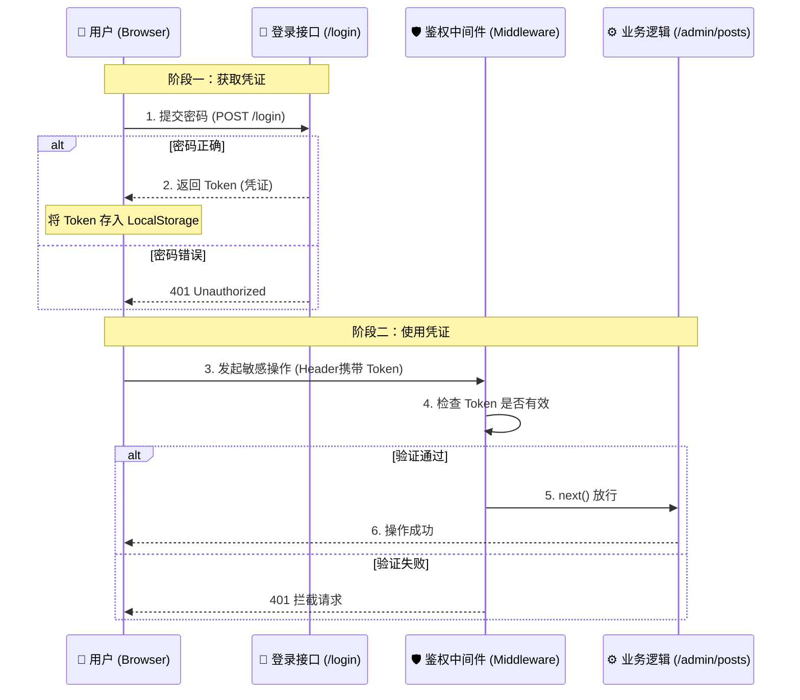

> 在现在的 Web 开发中，我们太习惯于依赖现成的库了：前端用 Auth0，后端用 Passport.js。但如果剥去这些层层封装，**“登录”这件事的本质究竟是什么？**
>
> 今天，我将剥离所有复杂的第三方库，带大家用最原生的 Go (Gin) 和 JavaScript，手搓一个包含**后端中间件拦截**、**前端 Token 管理**、**交互式登录弹窗**的完整鉴权系统。我们将不仅实现功能，更要探讨其背后的架构思维。

-----

## 第一章：顶层架构设计

在写代码之前，我们先梳理一下逻辑。对于个人博客系统（Mikuweb）而言，我们的需求非常明确：**单管理员模式**。

我们需要构建一个“闭环”：

1.  **前端**：拿着密码去换通行证（Token）。
2.  **前端**：把通行证缝在衣服上（LocalStorage），每次办事（发请求）都亮出来。
3.  **后端**：设置一道安检门（Middleware），有证的放行，没证的拦截。

### 数据流向图



-----

## 第二章：后端实现 —— 守门员的艺术 (Go + Gin)

后端的灵魂不在于那个 `login` 接口，而在于**中间件 (Middleware)** 的设计。

### 1\. 定义“上帝密码”与配置

为了演示最纯粹的逻辑，我们这里使用“硬编码”的单密码模式（生产环境请务必使用环境变量）。

```go
// main.go
const (
    // 这是唯一的通关秘籍，实际开发中建议读取 os.Getenv("APP_PASSWORD")
    ADMIN_PASSWORD = "miku_is_cute" 
    
    // 管理员公开信息
    ADMIN_NICKNAME = "awkker"
    ADMIN_AVATAR   = "/static/xunyi.png"
)
```

### 2\. 核心：编写鉴权中间件 (The Gatekeeper)

这是很多初学者容易卡住的地方。**中间件本质上是一个拦截器**。在 Gin 中，它控制着请求的生命周期。

```go
// AuthMiddleware 就像机场安检，不通过安检（Token错误），永远进不了候机厅（业务逻辑）
func AuthMiddleware() gin.HandlerFunc {
    return func(c *gin.Context) {
        // Step 1: 检查旅客有没有带“通行证”
        // 约定：前端必须在 HTTP Header 的 "Authorization" 字段中携带 Token
        token := c.GetHeader("Authorization")
        
        // Step 2: 验证通行证的真伪
        // 这里我们做简单的字符串比对，实际场景中通常是校验 JWT 的签名
        if token != ADMIN_PASSWORD {
            // 🛑 核心操作：Abort
            // Abort() 会阻止挂在当前路由下的后续 Handler 执行
            c.AbortWithStatusJSON(401, gin.H{
                "error": "权限不足：请先登录喵！(>_<)",
            })
            return // 必须 return，否则函数会继续向下跑
        }
        
        // ✅ 核心操作：Next
        // 验证通过，放行给下一个处理函数（比如发布文章的 Controller）
        c.Next()
    }
}
```

### 3\. 路由分组：声明式权限管理

有了中间件，我们不需要在每个接口里写 `if password == ...`。我们利用 **路由组 (Group)** 来圈定保护范围。

```go
func main() {
    r := gin.Default()

    // === 公共区域 (Public) ===
    // 任何人都可以看文章，不需要 Token
    r.GET("/posts", postController.GetList)
    r.POST("/login", authController.Login) // 登录接口本身必须是公开的

    // === 禁区 (Private/Admin) ===
    // 使用 Use() 挂载我们刚才写的中间件
    admin := r.Group("/admin")
    admin.Use(AuthMiddleware()) 
    {
        // 只有携带正确 Token 的请求才能到达这里
        admin.POST("/posts", postController.Create)   // 写文章
        admin.DELETE("/posts/:id", postController.Delete) // 删文章
    }

    r.Run(":8080")
}
```

-----

## 第三章：前端实现 —— 状态管理与微交互 (Native JS)

前端的难点在于：**HTTP 是无状态的，浏览器怎么“记住”我登录了？** 以及，如何通过微小的动画提升用户体验？

### 1\. 状态持久化：LocalStorage

我们使用 `localStorage` 而不是 `sessionStorage`，这样即使用户关闭浏览器再打开，登录状态依然存在。

```javascript
// static/js/user.js

// 封装一个 User 模块，负责管理身份
const UserModule = {
    // 检查是否登录：也就是看看兜里有没有 Token
    isLoggedIn() {
        return !!localStorage.getItem('auth_token');
    },

    // 登录成功后的处理
    loginSuccess(token, userInfo) {
        // 🗝️ 核心：把 Token 存起来！
        localStorage.setItem('auth_token', token);
        localStorage.setItem('user_info', JSON.stringify(userInfo));
        
        // 刷新页面，让 UI 根据新状态重新渲染
        location.reload();
    },

    // 退出登录
    logout() {
        // 销毁 Token
        localStorage.removeItem('auth_token');
        location.reload();
    }
};
```

### 2\. 发起带权的请求 (Fetch Wrapper)

这是最关键的一步。当我们调用后端的 `/admin` 接口时，必须**手动**把 Token 塞进 Header 里。

```javascript
async function deleteArticle(id) {
    const token = localStorage.getItem('auth_token');
    
    // 如果没有 Token，直接在这里拦截，省去一次网络请求
    if (!token) {
        alert("请先登录！");
        return;
    }

    const response = await fetch(`/admin/posts/${id}`, {
        method: 'DELETE',
        headers: {
            'Content-Type': 'application/json',
            // 🗝️ 核心：出示通行证！名字要和后端 GetHeader 里的保持一致
            'Authorization': token 
        }
    });

    if (response.status === 401) {
        // 容错处理：比如 Token 过期了，或者被后端改了密码
        alert("登录失效，请重新登录");
        UserModule.logout();
    }
}
```

### 3. UI 交互：Q 弹的错误反馈

当用户输错密码时，不要只弹一个冰冷的 `alert`。我们用 CSS 动画模拟一个“摇头”的动作，这会让网页感觉更有生命力。

**CSS (login.css):**
利用 `cubic-bezier` 贝塞尔曲线，实现一种富有弹性的抖动。

```css
@keyframes shake {
    0%, 100% { transform: translateX(0); }
    20%, 60% { transform: translateX(-10px); } /* 向左猛甩 */
    40%, 80% { transform: translateX(10px); }  /* 向右猛甩 */
}

/* 激活这个类名时，执行 0.5秒 的动画 */
.login-box.shake {
    animation: shake 0.5s cubic-bezier(.36,.07,.19,.97) both;
}
```

**JS 调用:**

```javascript
if (!response.ok) {
    // 添加类名触发动画
    loginBox.classList.add('shake');
    
    // 500ms 动画结束后，移除类名，以便下次还能触发
    setTimeout(() => {
        loginBox.classList.remove('shake');
    }, 500);
}
```

-----

## 第四章：安全性反思 (Production Note)

写到这里，我们已经完成了一个功能闭环。但作为一个有追求的开发者，必须诚实地指出当前实现的局限性。

如果这是在公司级的生产环境，我们需要做以下升级：

1.  **拒绝明文传输**：Token 和密码目前是在 HTTP 裸奔的。**解决方案**：必须部署 SSL 证书，启用 **HTTPS**。
2.  **拒绝前端明文存储**：LocalStorage 容易被 XSS 攻击读取。**解决方案**：使用 `HttpOnly Cookie`，这样 JS 读不到，但浏览器发请求会自动带上。
3.  **Token 时效性**：目前的 Token 是永久有效的。**解决方案**：引入 **JWT (JSON Web Token)**，设置 `exp` (过期时间) 字段。
4.  **密码存储**：后端不应明文比对密码。**解决方案**：数据库存储密码的哈希值（如 bcrypt），比对时使用 `bcrypt.CompareHashAndPassword`。

## 第五章：demo 展示

你可以在自己的电脑上尝试运行以下代码

### 项目结构

```text
demo/
├── main.go        # 后端：负责鉴权和 API
└── index.html     # 前端：包含页面、样式和 JS 逻辑
```

### 1\. 后端代码 (`main.go`)

> 这里展示了中间件拦截和 Token 验证的核心逻辑。

```go
package main

import (
	"net/http"
	"github.com/gin-gonic/gin"
)

// 🔐 配置上帝密码 (实际开发请用环境变量)
const APP_PASSWORD = "miku"

func main() {
	r := gin.Default()

	// 1. 静态文件服务 (用来展示前端页面)
	r.LoadHTMLFiles("index.html")
	r.GET("/", func(c *gin.Context) {
		c.HTML(200, "index.html", nil)
	})

	// 2. 登录接口 (公开)
	r.POST("/api/login", func(c *gin.Context) {
		var json struct {
			Password string `json:"password"`
		}
		if c.ShouldBindJSON(&json) == nil && json.Password == APP_PASSWORD {
			// 登录成功，直接把密码当作 Token 返回 (简化演示)
			c.JSON(200, gin.H{
				"token": APP_PASSWORD,
				"msg":   "欢迎回来，主人！",
			})
		} else {
			c.JSON(401, gin.H{"error": "密码错误喵！"})
		}
	})

	// 3. 需要权限的接口组
	admin := r.Group("/admin")
	admin.Use(AuthMiddleware()) // 🛡️ 挂载鉴权中间件
	{
		admin.POST("/delete", func(c *gin.Context) {
			c.JSON(200, gin.H{"status": "success", "data": "文章已删除！"})
		})
	}

	r.Run(":8080")
}

// 🛡️ 核心中间件：检查请求头里有没有 Token
func AuthMiddleware() gin.HandlerFunc {
	return func(c *gin.Context) {
		token := c.GetHeader("Authorization")

		if token != APP_PASSWORD {
			// 🚫 拦截请求，不再往下执行
			c.AbortWithStatusJSON(401, gin.H{"error": "无权访问，请先登录！"})
			return
		}

		// ✅ 放行
		c.Next()
	}
}
```

-----

### 2\. 前端代码 (`index.html`)

```html
<!DOCTYPE html>
<html lang="zh-CN">
<head>
    <meta charset="UTF-8">
    <title>Mikuweb 鉴权演示</title>
    <style>
        /* ✨ 简单的居中样式 */
        body {
            font-family: sans-serif;
            background: #f0f2f5;
            display: flex;
            justify-content: center;
            align-items: center;
            height: 100vh;
        }
        .card {
            background: white;
            padding: 2rem;
            border-radius: 16px;
            box-shadow: 0 4px 12px rgba(0,0,0,0.1);
            text-align: center;
            width: 300px;
        }
        input, button {
            width: 100%;
            margin-top: 10px;
            padding: 10px;
            box-sizing: border-box;
        }
        /* 🔴 核心：错误时的抖动动画 */
        .shake {
            animation: shake 0.5s cubic-bezier(.36,.07,.19,.97) both;
        }
        @keyframes shake {
            10%, 90% { transform: translate3d(-1px, 0, 0); }
            20%, 80% { transform: translate3d(2px, 0, 0); }
            30%, 50%, 70% { transform: translate3d(-4px, 0, 0); }
            40%, 60% { transform: translate3d(4px, 0, 0); }
        }
    </style>
</head>
<body>

<div class="card" id="login-box">
    <h2>🔐 请登录</h2>
    <input type="password" id="password" placeholder="输入 miku 试试">
    <button onclick="handleLogin()">登录</button>
</div>

<div class="card" id="admin-box" style="display: none;">
    <h2>👋 管理员模式</h2>
    <p>Token 已保存到 LocalStorage</p>
    <button onclick="sensitiveAction()">🗑️ 测试删除文章</button>
    <button onclick="logout()" style="background: #ff4757; color: white;">退出登录</button>
</div>

<script>
    // 🔄 页面加载时检查状态
    const token = localStorage.getItem('auth_token');
    if (token) toggleView(true);

    // 1️⃣ 登录逻辑
    async function handleLogin() {
        const pwd = document.getElementById('password').value;
        const box = document.getElementById('login-box');

        const res = await fetch('/api/login', {
            method: 'POST',
            headers: {'Content-Type': 'application/json'},
            body: JSON.stringify({ password: pwd })
        });

        if (res.ok) {
            const data = await res.json();
            localStorage.setItem('auth_token', data.token); // 保存 Token
            toggleView(true);
            alert(data.msg);
        } else {
            // ❌ 触发抖动动画
            box.classList.remove('shake'); // 重置动画
            void box.offsetWidth;          // 强制重绘
            box.classList.add('shake');    // 再次添加
        }
    }

    // 2️⃣ 敏感操作 (带 Token 请求)
    async function sensitiveAction() {
        const res = await fetch('/admin/delete', {
            method: 'POST',
            headers: {
                // 🗝️ 核心：把 Token 亮给后端看
                'Authorization': localStorage.getItem('auth_token')
            }
        });

        if (res.status === 401) {
            alert("Token 失效，请重新登录！");
            logout();
        } else {
            const data = await res.json();
            alert("操作成功：" + data.data);
        }
    }

    // 3️⃣ 辅助功能
    function logout() {
        localStorage.removeItem('auth_token');
        location.reload();
    }

    function toggleView(isLoggedIn) {
        document.getElementById('login-box').style.display = isLoggedIn ? 'none' : 'block';
        document.getElementById('admin-box').style.display = isLoggedIn ? 'block' : 'none';
    }
</script>
</body>
</html>
```

-----

## 总结

通过手搓这套系统，我们实际上复习了 Web 开发中最重要的几个概念：

  * **中间件模式**：如何解耦业务与鉴权。
  * **RESTful 规范**：利用 Header 传递元数据。
  * **状态管理**：前端如何利用 Storage 维持会话。
  * **交互细节**：如何用 CSS 提升用户体验。

哪怕是最简单的“单密码”系统，只要用心雕琢，也能成为你技术栈中闪光的一环。
