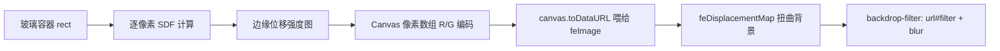

## 从 macOS 到 HarmonyOS：液态玻璃的前世今生

2024 年 WWDC，苹果发布了全新设计语言 **Liquid Glass（液态玻璃）**，随 macOS Sequoia 与 iOS 18 铺开。它不再是 2013 年 iOS 7 那层简单的毛玻璃（Frosted Glass），而是一种会「折射」的材质：窗口边缘像透镜一样把背后的内容扭曲，高光随视角流动，玻璃仿佛真的有了厚度和曲率。


苹果之后，各大厂商迅速跟进。**华为 HarmonyOS NEXT** 把「玻璃拟态」作为核心设计语言贯穿全系统；小米、OPPO 的系统中也不难看到类似材质的影子。一时间，「玻璃拟态」成了继拟物化、扁平化、新拟态（Neumorphism）之后的新一轮质感竞赛。

对前端开发者来说，这层材质有没有办法用 Web 技术复刻？答案是：**能**。这篇文章就用我博客里真实跑着的一套实现，把原理拆开讲透，文末附一个开箱即用的单文件 Demo。

> 本文代码来自本站开屏页的液态玻璃 Dock、顶栏与搜索框，你可以随时来 [xunyi.cloud](https://xunyi.cloud) 亲手摸一摸这些玻璃。
>
> 

## 三层递进：从模糊到折射

理解液态玻璃，最好把它拆成三层，每一层都能独立实现：

```plain
┌─────────────────────────────────┐
│ ③ 折射层：背景内容边缘扭曲       │  ← Liquid Glass 的灵魂
├─────────────────────────────────┤
│ ② 模糊层：背景内容整体虚化       │  ← 传统毛玻璃
├─────────────────────────────────┤
│ ① 质感层：半透明底 + 高光 + 阴影  │  ← 任何「玻璃感」的底色
└─────────────────────────────────┘
```

### 第一层：质感

半透明白底、1px 浅色边框、顶部一道斜向高光、底部柔和的投影：

```css
.glass {
  background: rgba(255, 255, 255, 0.4);
  border: 1px solid rgba(255, 255, 255, 0.6);
  box-shadow: 0 10px 36px rgba(10, 18, 34, 0.12),
              inset 0 1px 0 rgba(255, 255, 255, 0.75);
}
.glass::before {
  content: '';
  position: absolute;
  inset: 0;
  background: linear-gradient(120deg,
              rgba(255,255,255,0.56) 5%, rgba(255,255,255,0) 40%);
}
```

这层决定「像不像玻璃」，但还不会「动」。

### 第二层：模糊

`backdrop-filter` 一行代码让元素背后的内容虚化：

```css
backdrop-filter: blur(24px) saturate(1.3);
```

这就是 2013 年至今的「毛玻璃」。但它有个致命的局限：**整个玻璃面均匀模糊，边缘没有任何光学变化**——而真实的玻璃，越靠近边缘，背后的景物弯折越厉害。

### 第三层：折射

液态玻璃的关键在于：**模糊不是均匀的，边缘要产生「透镜畸变」**。背后的文字和图像经过玻璃边缘时，应该被轻微地拉扯、弯曲。

浏览器没有现成的「折射」CSS 属性，但 SVG 的滤镜体系里藏着一个完美的原语——`feDisplacementMap`。它能拿一张「位移图」，按图上每个像素的 R/G 通道值，把目标画面往横/竖方向推开。我们要做的，就是**自己画一张位移图**。

## 核心实现：用 Canvas 画一张位移图

整体渲染管线如下：



### 第一步：用 SDF 描述「玻璃的形状」

SDF（Signed Distance Field，有符号距离场）能回答一个问题：**任意一个像素到玻璃边缘的距离是多少？** 对于圆角矩形，SDF 函数长这样：

```ts
function roundedRectSdf(x: number, y: number, halfW: number, halfH: number, r: number) {
  // 把坐标变换到矩形中心，先向内收缩一个圆角半径
  const qx = Math.abs(x) - halfW + r;
  const qy = Math.abs(y) - halfH + r;
  // 内部点取负值，外部点取到圆角矩形的欧氏距离
  return Math.min(Math.max(qx, qy), 0) + Math.hypot(Math.max(qx, 0), Math.max(qy, 0)) - r;
}
```

### 第二步：把距离映射成「折射强度」

玻璃的边缘折射不是突然出现的，而是有一段过渡带。用 `smoothStep` 把距离值揉成 0~1 的强度：

```ts
const smoothStep = (a: number, b: number, t: number) => {
  const n = Math.max(0, Math.min(1, (t - a) / (b - a)));
  return n * n * (3 - 2 * n);
};

// edgeDistance 由 SDF 得出；cornerSoftness 控制过渡带宽度
const edgeDisplacement = smoothStep(1, 0, edgeDistance - cornerSoftness);
const scaled = smoothStep(0, 1, edgeDisplacement);

// 边缘再加一圈「增强环」，模拟光线掠过玻璃棱边的亮度
const edgeRing = 1 - smoothStep(-0.16, 0.24, edgeDistance);
const edgeBoost = 1 + edgeRing * edgeRefractionStrength;
```

### 第三步：编码进位移图

浏览器要求 `feDisplacementMap` 的位移图里：**R 通道 = X 方向位移，G 通道 = Y 方向位移**，取值范围 0~255 映射到 -1~1。我们把每个像素算出的位移向量归一化后写进 Canvas：

```ts
const data = new Uint8ClampedArray(width * height * 4);
// 先算出全图最大位移，用于归一化
// displacement 数组存每个像素的 (dx, dy)

for (let i = 0; i < data.length; i += 4) {
  const r = (dx / maxScale) / 2 + 0.5;  // 映射到 0..1
  const g = (dy / maxScale) / 2 + 0.5;
  data[i]     = Math.round(r * 255);
  data[i + 1] = Math.round(g * 255);
  data[i + 3] = 255;                    // 全不透明
}
ctx.putImageData(new ImageData(data, width, height), 0, 0);
```

### 第四步：把 Canvas 接进 SVG 滤镜

这是整个方案里最巧妙的一步：SVG 的 `feImage` 可以直接引用 `canvas.toDataURL()` 生成的 data URI，于是「JS 画的图」无缝变成「滤镜的输入」：

```ts
const svg = document.createElementNS('http://www.w3.org/2000/svg', 'svg');
const filter = document.createElementNS('http://www.w3.org/2000/svg', 'filter');
const feImage = document.createElementNS('http://www.w3.org/2000/svg', 'feImage');
const feDisplacement = document.createElementNS('http://www.w3.org/2000/svg', 'feDisplacementMap');

feImage.setAttributeNS(xlinkNS, 'href', canvas.toDataURL());
feDisplacement.setAttribute('in', 'SourceGraphic');
feDisplacement.setAttribute('in2', `${id}-map`);
feDisplacement.setAttribute('xChannelSelector', 'R');
feDisplacement.setAttribute('yChannelSelector', 'G');

filter.append(feImage, feDisplacement);
svg.append(filter);
document.body.appendChild(svg);
```

最后，把整条滤镜链挂到玻璃元素的 `backdrop-filter` 上，与基础的 blur/对比度叠加：

```ts
target.style.backdropFilter =
  `url(#${id}) blur(${blur}px) contrast(${contrast}) brightness(${brightness}) saturate(${saturate})`;
```

`url(#id)` 引用的滤镜作用于元素背后的画面（backdrop），于是背景先被位移图「折射」，再被 CSS 滤镜模糊增亮——三层效果至此全部打通。

## 让玻璃「活」起来：鼠标跟随折射

静态折射已经很像玻璃了，但苹果的液态玻璃还会随视角微微流动。Web 上没有视角，但**鼠标就是最好的视角**：

```ts
if (interactive) {
  target.addEventListener('mousemove', (event) => {
    const rect = target.getBoundingClientRect();
    // 鼠标在玻璃上的归一化坐标 (0~1)
    mouseX = (event.clientX - rect.left) / rect.width;
    mouseY = (event.clientY - rect.top) / rect.height;
    render();  // 重新生成位移图
  });
}
```

在逐像素循环里，把鼠标位置当作一个「引力源」，离鼠标越近的像素位移越小，越远则被推开：

```ts
const dxMouse = uvX - mouseX;
const dyMouse = uvY - mouseY;
const mouseDistance = Math.hypot(dxMouse, dyMouse);
// 高斯衰减：只在鼠标附近小范围产生影响
const mouseInfluence = Math.exp(-mouseDistance * 16) * 0.06;
mapped = { x: mapped.x + dxMouse * mouseInfluence,
           y: mapped.y + dyMouse * mouseInfluence };
```

每帧重绘一张 Canvas 位图看起来重，但实际上：`dpr` 上限 2、玻璃通常只有几百乘几十像素，加上只在 mousemove/resize 时重绘，性能开销完全可控。

## 性能与降级：优雅地退化为毛玻璃

- **Canvas 不可用时**（极端环境）：跳过位移图，`backdrop-filter` 只保留 `blur/contrast/brightness/saturate`，玻璃降级成第二层的毛玻璃，视觉不崩
- **ResizeObserver** 监听尺寸变化自动重绘位移图；`prefers-reduced-motion` 用户关闭鼠标跟随
- 位移图只在需要时生成，常驻成本只是几张几十 KB 的位图

## 完整可运行 Demo

下面是一个零依赖的单文件 Demo，保存成 `.html` 双击打开即可玩。它是一块**椭圆**液态玻璃，背景铺了光晕、条纹和 emoji 网格——**直接用鼠标拖动玻璃**，就像捏着一块透镜扫过桌面，边缘折射与高光实时变化：

```html
<!doctype html>
<html lang="zh">
<head>
<meta charset="utf-8">
<title>Liquid Glass Demo · 拖动我</title>
<style>
  * { box-sizing: border-box; }
  body { margin: 0; height: 100vh; overflow: hidden; position: relative;
         font-family: -apple-system, 'PingFang SC', sans-serif;
         background: #0f172a; user-select: none; }
  /* 复杂背景：三色光晕 + 斜向条纹 + emoji 网格 */
  .scene { position: absolute; inset: 0; overflow: hidden;
           background:
             radial-gradient(circle at 18% 22%, rgba(57,197,187,.4), transparent 42%),
             radial-gradient(circle at 82% 72%, rgba(192,132,252,.45), transparent 46%),
             radial-gradient(circle at 60% 26%, rgba(255,215,106,.28), transparent 36%); }
  .stripes { position: absolute; inset: -20%;
             background: repeating-linear-gradient(45deg,
               rgba(255,255,255,.07) 0 24px, transparent 24px 48px); }
  .grid { position: absolute; inset: 0; display: flex; flex-wrap: wrap;
          gap: 8px; padding: 10px; opacity: .92; }
  .grid span { width: 34px; height: 34px; display: grid; place-items: center; font-size: 20px; }
  .word { position: absolute; left: 50%; top: 44%; transform: translate(-50%,-50%);
          font-size: 42px; font-weight: 800; letter-spacing: .18em;
          color: rgba(255,255,255,.95); text-shadow: 0 4px 24px rgba(0,0,0,.4); }
  .hint { position: absolute; left: 50%; bottom: 22px; transform: translateX(-50%);
          color: rgba(255,255,255,.65); font-size: 14px; letter-spacing: .1em; }
  /* 椭圆液态玻璃（可拖动） */
  .glass { position: absolute; width: 300px; height: 180px; left: 50%; top: 50%;
           transform: translate(-50%,-50%); border-radius: 50%; cursor: grab;
           border: 1px solid rgba(255,255,255,.55);
           background: rgba(255,255,255,.16);
           box-shadow: 0 24px 60px rgba(0,0,0,.35), inset 0 2px 0 rgba(255,255,255,.6);
           touch-action: none; }
  .glass.dragging { cursor: grabbing; }
  .glass::before { content:''; position:absolute; inset:0; border-radius:inherit;
    background: linear-gradient(120deg, rgba(255,255,255,.5) 8%, rgba(255,255,255,0) 40%); }
</style>
</head>
<body>
  <div class="scene">
    <div class="stripes"></div>
    <div class="grid" id="grid"></div>
    <div class="word">LIQUID GLASS</div>
  </div>
  <div class="glass" id="glass"></div>
  <div class="hint">🖱 拖动玻璃，看背后的世界被折射</div>
<script>
const emojis = ['🌸','🌿','🍀','💠','🔷','🟣','🫧','✨','🎐','🌊','🍃','💧'];
const grid = document.getElementById('grid');
for (let i = 0; i < 180; i++) {
  const s = document.createElement('span');
  s.textContent = emojis[i % emojis.length];
  grid.appendChild(s);
}

const NS = 'http://www.w3.org/2000/svg';
const XNS = 'http://www.w3.org/1999/xlink';
const target = document.getElementById('glass');

const svg = document.createElementNS(NS, 'svg');
svg.setAttribute('width', 0); svg.setAttribute('height', 0);
svg.style.position = 'fixed'; svg.style.pointerEvents = 'none';
const filter = document.createElementNS(NS, 'filter');
filter.setAttribute('id', 'lg');
filter.setAttribute('filterUnits', 'userSpaceOnUse');
filter.setAttribute('color-interpolation-filters', 'sRGB');
const feImage = document.createElementNS(NS, 'feImage');
feImage.setAttribute('id', 'lg-map');
const feMap = document.createElementNS(NS, 'feDisplacementMap');
feMap.setAttribute('in', 'SourceGraphic');
feMap.setAttribute('in2', 'lg-map');
feMap.setAttribute('xChannelSelector', 'R');
feMap.setAttribute('yChannelSelector', 'G');
filter.append(feImage, feMap); svg.append(filter);
document.body.appendChild(svg);

const canvas = document.createElement('canvas');
const ctx = canvas.getContext('2d');
const smooth = (a,b,t)=>{const n=Math.max(0,Math.min(1,(t-a)/(b-a)));return n*n*(3-2*n);};
// 椭圆 SDF：坐标按长短轴缩放成单位圆后算距离，再按短轴还原尺度
const ellipseSdf = (x, y, rx, ry) => {
  const len = Math.hypot(x / rx, y / ry);
  return (len - 1) * Math.min(rx, ry);
};

function render() {
  const rect = target.getBoundingClientRect();
  const dpr = Math.min(devicePixelRatio || 1, 2);
  const w = Math.max(1, Math.floor(rect.width * dpr));
  const h = Math.max(1, Math.floor(rect.height * dpr));
  canvas.width = w; canvas.height = h;
  feImage.setAttribute('width', rect.width);
  feImage.setAttribute('height', rect.height);
  const data = new Uint8ClampedArray(w * h * 4);
  const disp = []; let maxScale = 0;
  for (let i = 0; i < data.length; i += 4) {
    const x = (i / 4) % w, y = Math.floor(i / 4 / w);
    const ux = x / w - 0.5, uy = y / h - 0.5;
    // 椭圆边缘折射 + 边缘增强环（透镜棱边更亮）
    const edge = ellipseSdf(ux, uy, 0.5, 0.5);
    const strength = smooth(0, 1, smooth(1, 0, edge - 0.14));
    const ring = 1 - smooth(-0.14, 0.2, edge);
    const boost = 1 + ring * 0.7;
    const mx = ux * strength + 0.5, my = uy * strength + 0.5;
    const dx = (mx * w - x) * boost, dy = (my * h - y) * boost;
    maxScale = Math.max(maxScale, Math.abs(dx), Math.abs(dy));
    disp.push(dx, dy);
  }
  maxScale = Math.max(maxScale * 0.5, 0.0001);
  let j = 0;
  for (let i = 0; i < data.length; i += 4) {
    data[i]     = Math.round((disp[j++] / maxScale / 2 + 0.5) * 255);
    data[i + 1] = Math.round((disp[j++] / maxScale / 2 + 0.5) * 255);
    data[i + 3] = 255;
  }
  ctx.putImageData(new ImageData(data, w, h), 0, 0);
  feImage.setAttributeNS(XNS, 'href', canvas.toDataURL());
  feMap.setAttribute('scale', maxScale / dpr);
}
target.style.backdropFilter =
  'url(#lg) blur(.4px) contrast(1.16) brightness(1.05) saturate(1.3)';

// 拖动：把玻璃当透镜扫过背景，折射实时重绘
let dragging = false, offX = 0, offY = 0;
target.addEventListener('pointerdown', (e) => {
  dragging = true;
  target.classList.add('dragging');
  target.setPointerCapture(e.pointerId);
  const r = target.getBoundingClientRect();
  offX = e.clientX - r.left; offY = e.clientY - r.top;
});
target.addEventListener('pointermove', (e) => {
  if (!dragging) return;
  target.style.left = (e.clientX - offX) + 'px';
  target.style.top  = (e.clientY - offY) + 'px';
  render();
});
target.addEventListener('pointerup', () => {
  dragging = false;
  target.classList.remove('dragging');
});
new ResizeObserver(render).observe(target);
render();
</script>
</body>
</html>
```

## 本站的落地：Dock、顶栏与搜索框

这套实现没有停留在 Demo，而是真实跑在 [xunyi.cloud](https://xunyi.cloud) 的各个玻璃面上：

- **开屏 Dock**：液态玻璃底座 + 折射跟随鼠标，配合 rAF 惯性放大、相邻图标挤压的 macOS 手感
- **博客顶栏**：跨页 persist 的通栏玻璃条，滚动时玻璃变实，夜间切换薰衣草紫
- **搜索弹窗**、**音乐面板**：同一套 `createLiquidGlass` 工具，参数各自微调

落地过程中踩过的坑也值得记一笔：`backdrop-filter` 上同时挂 `url(#filter)` 与 CSS 滤镜时，顺序与 `filterUnits` 设置都会影响渲染；Safari 需要 `-webkit-backdrop-filter` 前缀；而 `canvas.toDataURL()` 每帧生成 data URI 有 GC 压力，适合「按需重绘」而不是逐帧循环。

## 写在最后

从 2013 年的毛玻璃到 2024 年的液态玻璃，苹果花了十一年把一层材质雕琢成品牌语言；而 Web 用 `backdrop-filter`、SVG `feDisplacementMap` 和一张 Canvas 位移图，就能让同样的质感在任何浏览器里流动。玻璃之下，折射的其实是我们对「细节」这件事的执着。

> 本站全部玻璃实现已开源在博客仓库，欢迎取用与魔改。
